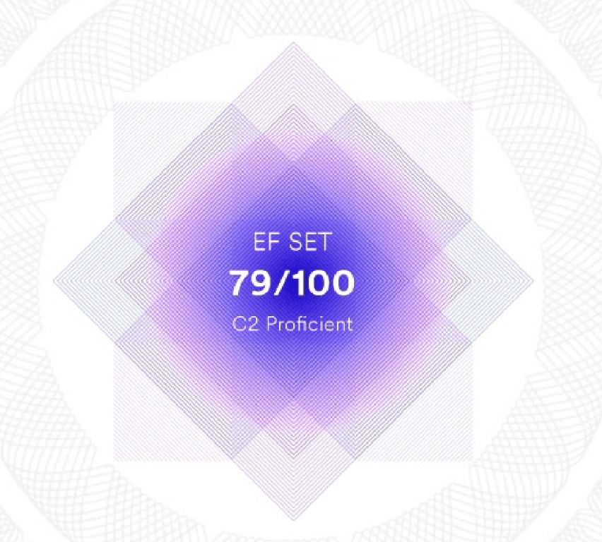

# Maria Koval #

## Junior Front-End developer ##
---
### Contact information: ###

**Phone:** +7 931-364-82-33

**E-mail:** marfantyk@gmail.com

**Telegram:** @marfantyk

**GitHub:** [marfantyk](https://github.com/Marfantyk)

**Instragram:** [koval.mdesign](https://vk.com/away.php?utf=1&to=https%3A%2F%2Finstagram.com%2Fkoval.mdesign%3Figshid%3DYmMyMTA2M2Y%3D)

-----

### About me: ###

----
### Education: ###
**University:** Pavlov First State Medical University of St. Petersburg, Dentistry Department
**Courses:** 
* CS50x, 
* FreeCodeCamp


----
### Skills: ###

1. HTML5, CSS3, Bootstrap
2. JavaScript
3. Git, GitHub
4. Basics of C, Python, Flask
5. Adobe Illustrator
----
### Code examples: ###
The following code was used to creat popping-up greeting message:
```javascript
const myTimeout = setTimeout(appear, 2500);
function appear(){
    document.getElementById('box').style.display = "block";
    }
function dissap(){
    document.getElementById('box').style.display = "none";
    }
```
----

### Languages ###
* Russian - native
* English - B2-C1, advanced (according to online test [EFSET](https://www.efset.org/quick-check/))
* Portuguese - A1